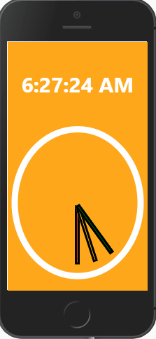

# React Clock

### Table of Contents

1. Purpose
2. Motivation
3. Technologies Used

### Purpose:

Clock web app made with React and based on Wes Bos's JavaScript 30 tutorial.

### Motivation:

The goal was to practice building apps in shorter time periods with React.

### This app was built with the following technologies:

**React:** JavaScript front-end library for building user interfaces

**Git-Hub:** Web-based version control repository and Internet hosting service

**JavaScript:** Object-oriented programming language for web pages

**HTML:** Mark-up language for creating web pages

**CSS:** A formatting language for styling web pages

_Created by JC Smiley in November of 2020_